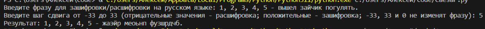

# Applied Coding 5
## Исполнитель    
Фадеев Алексей    
группа ФТ-220007    
## Лабораторная работа №5       
***Циклы, строки, списки - Шифр Цезаря***    
    
Написать на любом языке программу: шифрование и расшифровка текста шифром Цезаря. Пользователь вводит строку и шаг сдвига. Заглавные символы должны быть заменены заглавными, цифры и знаки препинания оставить без изменения.   Задание * разработать графический интерфейс. 
## Среда разработки    
Язык программирования: Python.    
Среда разработки: Visual Studio Code.    
## Инструкция по работе    
Входные данные: строка на русском языке, число - сдвиг от -33 до 33.    
Выходные данные: зашифрованная/расшифрованная строка.  
## Тесты    
Тест 1    
    
Тест 2    
    
Тест 3    
    
Тест 4    
  
